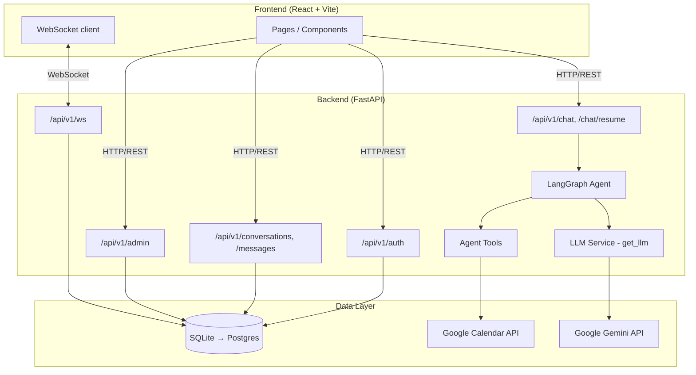
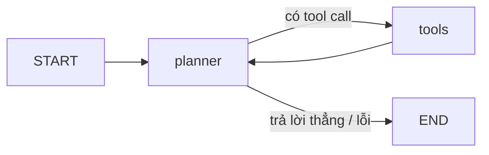
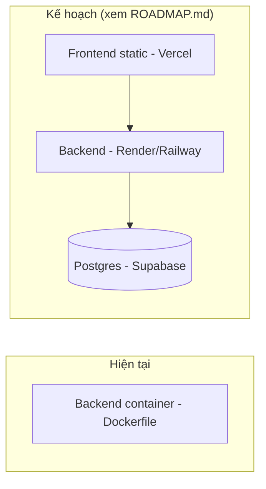

# Architecture Document

## System Overview

Orbit là AI agent nhúng trong ứng dụng chat: FastAPI + LangGraph ở backend, React + Vite ở
frontend, SQLite (sẽ chuyển Postgres — xem [ROADMAP.md](ROADMAP.md)) làm database. Backend đã có
auth thật (JWT + bcrypt), nhắn tin 1-1/nhóm realtime qua WebSocket, phân quyền role user/admin, và
agent LangGraph (LLM: Google Gemini) với các tool có human-in-the-loop (calendar, reminder) cùng tool
tóm tắt hội thoại theo yêu cầu.

## Architecture Diagram

## Components

### 1. Frontend (React + Vite)
- **Purpose:** SPA cho toàn bộ trải nghiệm người dùng — auth, chat realtime, AI assistant, admin.
- **Key Features:** đăng ký/đăng nhập, chat 1-1/nhóm với WebSocket, panel AI (tóm tắt hội thoại
  theo yêu cầu), trang Admin (dashboard/user/conversation management). Các trang Tasks/Calendar/
  Reminders/Memory/Profile hiện là UI mẫu chạy trên `Frontend/src/data/mockData.js`, chưa nối API
  thật (xem [ROADMAP.md](ROADMAP.md) Giai đoạn 1).
- **State Management:** React Context (`AuthContext` cho JWT/user hiện tại) + hook riêng theo tính
  năng (`useConversations`, `useMessages`), không dùng store toàn cục (Redux/Zustand).

### 2. Backend (FastAPI)
- **Purpose:** REST API + WebSocket cho auth, nhắn tin, quản trị, và cổng vào AI agent.
- **API Design:** RESTful, mounted dưới `/api/v1` (`src/api/auth_routes.py`, `chat_routes.py`,
  `admin_routes.py`, `routes.py` cho agent chat), route mỏng — business logic nằm ở `src/services/`.
- **Authentication:** JWT (PyJWT), password hash bcrypt (`src/auth/`). `get_current_user` +
  `require_admin` dependency cho phân quyền 2 role (`user`/`admin`).

### 3. AI Agent (LangGraph)
- **Agent Type:** Plan-and-execute dạng đơn giản — 1 node `planner` (LLM bound tools) ⇄ 1 node
  `tools` (`ToolNode`), lặp tới khi planner trả lời không kèm tool call.
- **State:** `AgentState` (TypedDict, `total=False`) — `messages` (reducer `add_messages`),
  `context` (text hội thoại truyền vào để tóm tắt), `summary`, `error`, ... (`src/agents/state.py`).
- **Nodes:** `planner_node` (`src/agents/nodes/planner_node.py`) — bind `ALL_TOOLS`, gọi LLM với
  `SYSTEM_PROMPT`, bắt exception vào `state["error"]`.
- **Tools** (`src/agents/tools/`, registry `ALL_TOOLS` trong `tools/__init__.py`):
  - `summarize_conversation` — đọc `state["context"]` (không cần xác nhận).
  - `create_calendar_event` / `list_calendar_events` — Google Calendar thật qua
    `google-api-python-client`; `create_*` bắt buộc `interrupt()` chờ xác nhận người dùng trước
    khi gọi API thật.
  - `create_reminder` / `list_reminders` — tương tự, `interrupt()` trước khi lên lịch qua
    APScheduler; **lưu in-memory, mất khi restart server** (xem Giai đoạn 1 trong ROADMAP).
- **Flow:**

### 4. Database
- **Type hiện tại:** SQLite (`sqlite:///./data/app.db`, qua SQLAlchemy async + `aiosqlite`).
  Không dùng Alembic — schema mới vá bằng `ALTER TABLE` tay trong `src/db/session.py::init_db()`
  (xem cách đã làm cho cột `role`/`is_active` của `User`).
- **Kế hoạch:** chuyển sang **PostgreSQL (Supabase)** + Alembic thật khi làm Giai đoạn 0 của
  [ROADMAP.md](ROADMAP.md) — cần vì các bảng mới (`tasks`, `reminders`, `ai_permissions`,
  `llm_usage`) cần bền vững qua restart và chịu tải tốt hơn khi deploy thật.
- **Tables hiện có:** `User` (role, is_active), `Conversation`, `ConversationParticipant`,
  `Message` (`src/db/models.py`).

### 5. Vector Store
- **Hiện tại:** chưa có — `chroma_persist_dir` đã khai báo sẵn trong `src/config.py` nhưng
  `chromadb` đang comment trong `requirements.txt`, chưa nối.
- **Kế hoạch:** **ChromaDB embedded** (chạy trong process FastAPI, không cần cloud) cho memory
  ngữ cảnh/preference người dùng dài hạn qua nhiều phiên — xem Giai đoạn 1.4 trong ROADMAP.

## Data Flow

1. User gửi tin nhắn/thao tác từ Frontend qua REST hoặc WebSocket.
2. Route xác thực (JWT) và validate input (Pydantic schema trong `src/models/`).
3. Với tin nhắn agent (`POST /api/v1/chat`): build `AgentState`, chạy qua LangGraph
   (`src/agents/graph.py::agent`, checkpoint theo `thread_id`).
4. Planner gọi LLM (Google Gemini); nếu cần hành động có tác dụng phụ (calendar/reminder), graph dừng lại
   ở `interrupt()` chờ xác nhận qua `POST /api/v1/chat/resume`.
5. Kết quả trả về Frontend; với chat người-với-người, tin nhắn được broadcast realtime qua
   `src/websocket/` tới các thành viên khác trong cuộc trò chuyện.

## Deployment Architecture

`Dockerfile` (multi-stage, non-root, healthcheck `/health`) và `docker-compose.yml` hiện chỉ định
nghĩa service `backend` — chưa có deploy online thật, chưa có CD workflow ngoài `ci.yml` (lint +
test). Kế hoạch deploy chi tiết ở Giai đoạn 1.5 trong [ROADMAP.md](ROADMAP.md).

## Security

- API key/secret đọc từ `.env` (không commit), ví dụ `GOOGLE_API_KEY`, `SECRET_KEY`.
- Input validation qua Pydantic ở mọi route.
- Password hash bcrypt, JWT cho auth — xem quy ước "không tự ý đổi cơ chế" trong `CLAUDE.md`.
- CORS cấu hình qua `cors_origins` trong `.env`.
- Human-in-the-loop bắt buộc cho mọi tool có tác dụng phụ (calendar, reminder) — không được bỏ
  qua kể cả để test nhanh (quy ước trong `CLAUDE.md`).
- Rate limiting: **chưa có** trên API endpoints — chưa nằm trong roadmap hiện tại, cân nhắc nếu
  deploy thật và mở public.
- Quyền AI đọc hội thoại: hiện chỉ là toggle UI cục bộ trong `AIPanel.jsx` (chưa gắn backend) —
  sẽ thành bảng `ai_permissions` thật ở Giai đoạn 0 của ROADMAP, đặc biệt cần trước khi agent chủ
  động (Giai đoạn 2) được phép tự đọc hội thoại.

## Design Decisions

| Decision | Choice | Reason |
| --- | --- | --- |
| Backend framework | FastAPI | Async, auto-docs (`/docs`), type-safe qua Pydantic |
| Agent orchestration | LangGraph | Quản lý state + human-in-the-loop (`interrupt`) sẵn có, phù hợp yêu cầu xác nhận trước hành động |
| LLM provider | Google Gemini (`ChatGoogleGenerativeAI`, model `gemini-2.5-flash`) | Free tier hào phóng, hỗ trợ tool-calling, đổi qua đúng 1 điểm nối (`src/services/llm.py::get_llm()`) |
| Database (hiện tại) | SQLite | Zero-config cho dev/demo giai đoạn đầu |
| Database (kế hoạch) | PostgreSQL (Supabase) | Cần cho các bảng mới bền vững qua restart + concurrency khi deploy — xem ROADMAP Giai đoạn 0 |
| Vector store (kế hoạch) | ChromaDB embedded | Không cần thêm service cloud, config đã có sẵn, đủ cho quy mô dự án |
| Frontend framework | React + Vite | Giữ nguyên so với đề bài gợi ý Next.js — tránh viết lại toàn bộ frontend không tương xứng lợi ích |
| Realtime | WebSocket thuần (FastAPI) | Đã chạy thật cho chat; tái dùng cho reminder-fired/proactive-suggestion thay vì mở kênh song song |
| Scheduler | APScheduler (kế hoạch: `SQLAlchemyJobStore`) | Đã dùng sẵn cho reminder; đổi jobstore để bền vững thay vì đổi hẳn sang BullMQ/Node |

Chi tiết từng giai đoạn triển khai các quyết định trên: xem [ROADMAP.md](ROADMAP.md).
