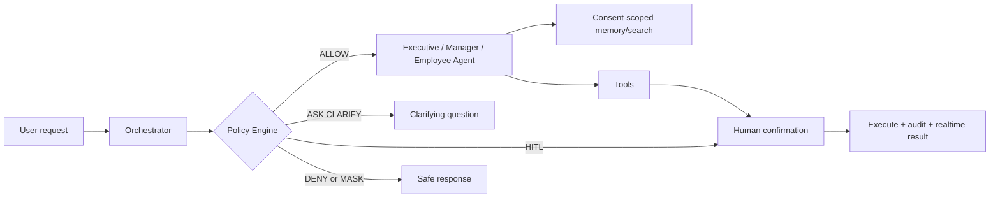

# Product Brief — Orbit / CHAT-01

> AI Agent trợ lý cá nhân trong chat doanh nghiệp: tóm tắt hội thoại, trích việc, nhắc việc và lên lịch.
>
> Cập nhật: 2026-08-13 · Kế hoạch delivery: 7 ngày · Nhóm: 4 người

## 1. Bối cảnh đề bài

Người dùng nội bộ Tập đoàn X nhận hàng trăm tin nhắn mỗi ngày qua chat cá nhân, nhóm phòng ban và
các cộng đồng nội bộ. Quyết định, deadline, lời hứa và lịch hẹn bị chôn trong luồng chat. Việc đọc
lại thủ công tốn thời gian; bỏ qua thì dễ quên việc hoặc trễ lịch.

Orbit biến nội dung **đã được người dùng cấp quyền** thành ba đầu ra có thể hành động:

1. Tóm tắt phần hội thoại cần thiết.
2. Task/reminder có nguồn gốc và độ tin cậy.
3. Sự kiện Google Calendar chỉ được tạo sau xác nhận hợp lệ.

## 2. Ba vai trò nghiệp vụ

| Vai trò | Phạm vi dữ liệu mặc định | Nhu cầu chính | Agent phục vụ |
|---|---|---|---|
| **Sếp** | Dữ liệu tổng hợp toàn đơn vị mà sếp có quyền; không mặc định đọc toàn bộ raw chat | Tình hình, rủi ro, quyết định, ưu tiên liên phòng | Executive Agent |
| **Trưởng phòng** | Nhóm/phòng mình quản lý; team inbox; dữ liệu tổng hợp của nhân viên trực thuộc | Theo dõi việc, deadline, cam kết và tải công việc của phòng | Manager Agent |
| **Nhân viên** | Chat được tham gia và cấp AI consent; task, memory, lịch cá nhân | Tóm tắt, tìm tin cũ, trích task, tạo reminder/lịch cá nhân | Employee Agent |

`platform_admin` là quyền vận hành hệ thống và audit, **không phải agent nghiệp vụ thứ tư**. Admin
không tự động được đọc nội dung nội bộ; muốn hỗ trợ phải có support grant đúng scope và thời hạn.

## 3. Giải pháp

Hệ thống dùng một Orchestrator để chọn đúng role-agent, sau đó bắt buộc đi qua Policy Engine trước
khi đọc dữ liệu hoặc gọi tool. Ba agent chia sẻ các capability tóm tắt, trích task, semantic search,
memory, reminder và calendar nhưng khác nhau ở scope dữ liệu và dạng đầu ra.

## 4. Giá trị mang lại

- Nhân viên giảm thời gian rà chat và giảm bỏ sót deadline.
- Trưởng phòng có team inbox ưu tiên mà không phải đọc mọi chat riêng tư.
- Sếp nhận executive summary dựa trên dữ liệu tổng hợp được phép.
- Mọi side effect quan trọng có xác nhận, provenance và audit.
- Tổ chức giữ ranh giới dữ liệu giữa cá nhân, phòng ban và cấp điều hành.

## 5. Nguyên tắc không đánh đổi

1. **Privacy first:** chỉ xử lý message nằm trong vùng đã giải mã và đã được consent; không gửi raw
   content ngoài scope được phép; không ghi raw content vào audit/vector metadata.
2. **Policy before prompt:** kiểm quyền bằng code/DB trước khi ghép context cho LLM. Prompt không
   phải hàng rào bảo mật duy nhất.
3. **Human-in-the-loop:** create/update/delete calendar, tạo reminder cho người khác, gửi/chia sẻ
   kết quả và thao tác liên phòng luôn dừng chờ xác nhận.
4. **Precision over recall:** task mơ hồ hoặc confidence thấp chỉ là suggestion hoặc câu hỏi làm rõ,
   không tự tạo reminder.
5. **Least context:** lấy đúng scope thời gian và số message cần thiết; dùng search trước khi nạp
   lịch sử dài; cache summary theo `conversation + consent_scope_hash + message_cursor`.
6. **Traceable:** lưu actor, policy decision, tool, target, source IDs, prompt/model version và kết
   quả; không lưu nội dung nhạy cảm vào audit.

## 6. Phạm vi MVP 7 ngày

### Must-have

- Đăng nhập và RBAC ba vai trò Sếp/Trưởng phòng/Nhân viên; admin app tiếp tục là control plane.
- Role router và ba system prompt có version.
- Employee flow: summarize, search, extract task, reminder/calendar HITL.
- Manager flow: team task dashboard, nhóm có quyền quản lý, overdue/follow-up summary.
- Executive flow: aggregate summary từ dữ liệu đã được policy cho phép.
- Proactive suggestion khi message mới có cam kết/lịch hẹn; không tự tạo side effect.
- Memory consent-scoped, Google Calendar per-user, WebSocket notification.
- Audit/policy decision, token budget, rate limiting và eval task extraction.
- Deploy backend + hai frontend online.

### Có thể cắt nếu trễ

- Semantic search bằng pgvector: giữ keyword/time-window search hiện tại làm fallback.
- Cross-department approval UI hoàn chỉnh: demo một workflow manager approval.
- Executive chart nâng cao: ưu tiên summary và KPI card có nguồn dữ liệu.

### Không làm trong tuần

- Tự xây thuật toán E2E encryption.
- Agent tự gửi tin hoặc tạo lịch cho người khác không xác nhận.
- Fine-tune model, voice/video, mobile native, multi-region hay scale nhiều worker.

## 7. Kết quả demo bắt buộc

1. Nhân viên hỏi “Tóm tắt tin chưa đọc và tôi cần làm gì?” → summary + task suggestion có nguồn.
2. Nhân viên xác nhận reminder/calendar → side effect chỉ xảy ra sau Confirm.
3. Trưởng phòng mở Team Inbox → xem overdue/upcoming của đúng phòng, không thấy chat riêng trái phép.
4. Sếp hỏi tình hình → nhận aggregate insight; yêu cầu raw chat ngoài scope bị deny/mask.
5. Message có cam kết mới → proactive suggestion đẩy qua WebSocket.
6. Admin xem usage, health và audit nhưng không thấy raw conversation content.

## 8. Tiêu chí thành công

| Nhóm | Metric MVP | Ngưỡng release |
|---|---|---:|
| Task extraction | Precision / Recall / F1 | ≥ 0.90 / ≥ 0.80 / ≥ 0.85 |
| Deadline extraction | Date-time accuracy | ≥ 0.90 |
| An toàn | Side effect cần HITL được xác nhận | 100% |
| Privacy | Unauthorized raw-message disclosure trong red-team set | 0 |
| Routing | Chọn đúng role-agent | ≥ 95% |
| Hiệu năng | P95 summarize/search không gồm cold start | < 5 giây |
| Proactive | Message-send overhead P95 | < 300 ms |
| Chi phí | Token/request và token/user/day | Có baseline + budget alert |
| Chất lượng phần mềm | Test, lint, user/admin build | 100% pass |

Chi tiết: [PRD](PRD.md), [kiến trúc](architecture_diagram.md), [agent specification](AGENT_SYSTEM_DESIGN.md),
[UI flow](UI_FLOW.md), [bản đồ kiểm thử](TESTING_OVERVIEW.md), [metrics](../metric.md),
[kế hoạch 7 ngày](ONE_WEEK_PLAN.md).
