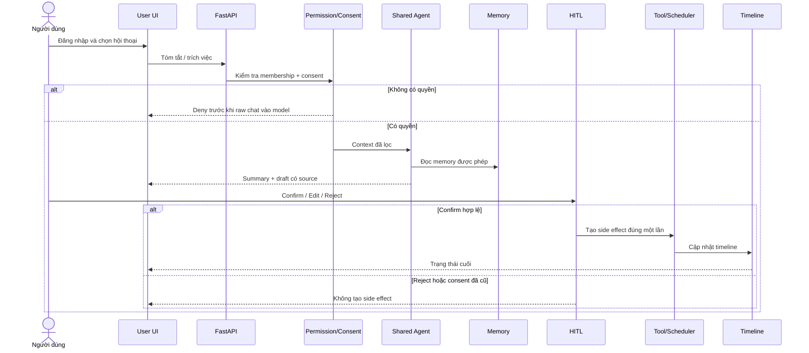
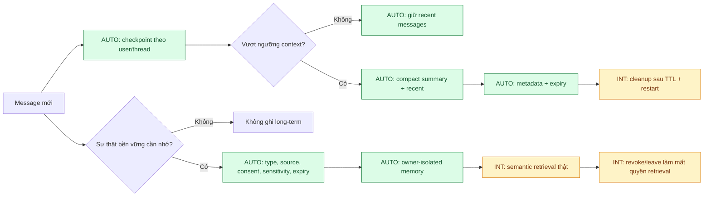
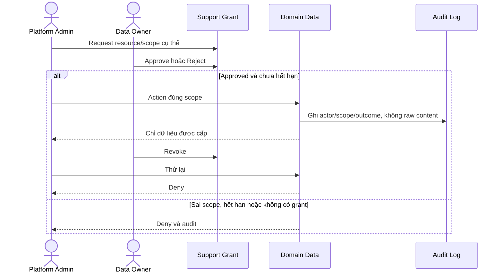
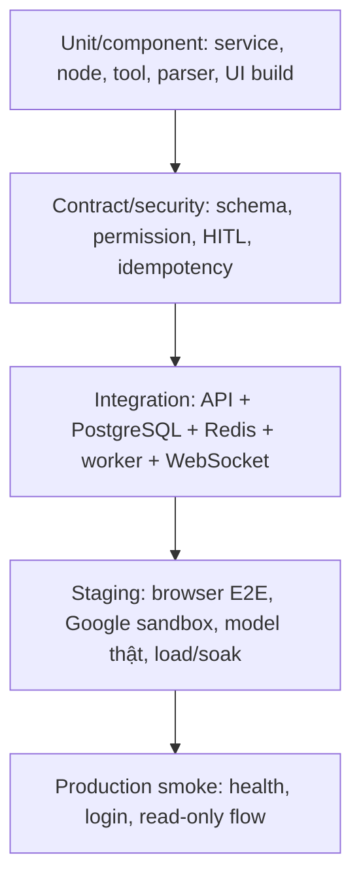

# Bức tranh kiểm thử toàn hệ thống — Orbit CHAT-01

> Mục tiêu: nhìn một lần để biết **đang test được gì**, **còn thiếu gì**, và một bản build phải đi qua các cổng nào trước khi demo/release.
>
> `CURRENT` là code hiện có. Kiến trúc Executive/Manager/Employee Agent là `TARGET`, chưa được tính là đã hoàn thành.

## 1. Chú thích

| Nhãn | Ý nghĩa |
|---|---|
| **AUTO** | Đã có automated test backend hoặc kiểm tra build frontend |
| **INT** | Cần integration test với dịch vụ/hạ tầng thật hoặc browser E2E |
| **MANUAL** | Cần kiểm tra bằng tay ở demo/staging |
| **TARGET** | Kiến trúc đích, chưa có đầy đủ để test end-to-end |

## 2. Bản đồ kiểm thử toàn cảnh

```mermaid
flowchart TB
    classDef auto fill:#dcfce7,stroke:#15803d,color:#14532d,stroke-width:2px
    classDef partial fill:#fef3c7,stroke:#d97706,color:#78350f,stroke-width:2px
    classDef target fill:#dbeafe,stroke:#2563eb,color:#1e3a8a,stroke-width:2px,stroke-dasharray:5 5
    classDef gate fill:#f3e8ff,stroke:#7e22ce,color:#581c87,stroke-width:2px
    classDef fail fill:#fee2e2,stroke:#dc2626,color:#7f1d1d,stroke-width:2px

    START([Bản build cần kiểm thử]) --> STATIC

    subgraph L0[0. Nền mã nguồn]
      STATIC["AUTO: Ruff + backend test"]:::auto
      BUILD["AUTO: User UI build + Admin UI build"]:::auto
      MIGRATION["AUTO: migration chain + workspace migration"]:::auto
      STATIC --> BUILD --> MIGRATION
    end

    MIGRATION --> IDENTITY
    subgraph L1[1. Identity, quyền và consent]
      IDENTITY["AUTO: đăng ký, đăng nhập, token"]:::auto
      RBAC["AUTO: workspace role + resource ownership"]:::auto
      CONSENT["AUTO: quyền AI đọc chat + contribution consent"]:::auto
      SUPPORT["AUTO: support grant có scope, hạn dùng, revoke"]:::auto
      PRIVACY["AUTO: admin không mặc định đọc raw chat"]:::auto
      IDENTITY --> RBAC --> CONSENT
      RBAC --> SUPPORT --> PRIVACY
    end

    CONSENT --> USER_DOMAIN
    PRIVACY --> ADMIN_DOMAIN
    subgraph L2[2. Luồng người dùng]
      USER_DOMAIN["AUTO: direct/group chat, unread, hide, leave"]:::auto
      TASK["AUTO: task CRUD, isolation, timezone, sorting"]:::auto
      REMINDER["AUTO: reminder CRUD + scheduler behavior"]:::auto
      CALENDAR["AUTO mock: OAuth/token/poll/broadcast"]:::auto
      TIMELINE["AUTO: gộp task + reminder + calendar, partial failure"]:::auto
      PEOPLE["AUTO: people intelligence + relationships"]:::auto
      USER_DOMAIN --> TASK --> REMINDER --> TIMELINE
      USER_DOMAIN --> PEOPLE
      CALENDAR --> TIMELINE
    end

    subgraph L3[3. Agent core và memory]
      AGENT["AUTO: planner, graph, tool routing cơ bản"]:::auto
      SUMMARY["AUTO: summarize + task/event extraction"]:::auto
      HITL["AUTO: interrupt, confirm/resume, stale consent"]:::auto
      SHORT["AUTO: checkpoint + compact theo số message"]:::auto
      LONG["AUTO: memory CRUD, isolation, expiry, provenance"]:::auto
      PROACTIVE["AUTO: rule, suggestion, dedupe, consent, budget"]:::auto
      TTL["INT: TTL cleanup, restart, concurrent requests thật"]:::partial
      RETRIEVAL["INT: semantic retrieval + revoke/invalidate E2E"]:::partial
      AGENT --> SUMMARY --> HITL
      AGENT --> SHORT --> TTL
      AGENT --> LONG --> RETRIEVAL
      USER_DOMAIN --> AGENT
      PROACTIVE --> HITL
    end

    subgraph L4[4. Admin và vận hành]
      ADMIN_DOMAIN["AUTO: user/statistics/role/deactivation"]:::auto
      DATA_ADMIN["AUTO: task/memory/reminder theo support scope"]:::auto
      AUDIT["AUTO: audit không nhận metadata nhạy cảm"]:::auto
      USAGE["AUTO: usage, budget, AI health/management"]:::auto
      ADMIN_DOMAIN --> DATA_ADMIN --> AUDIT
      ADMIN_DOMAIN --> USAGE
    end

    subgraph L5[5. Hạ tầng và dịch vụ ngoài]
      POSTGRES["INT: PostgreSQL thật, migration, restart"]:::partial
      REDIS["INT: Redis/queue, scheduler dài hạn"]:::partial
      WS["AUTO API; INT nhiều instance/reconnect"]:::partial
      GCAL["INT: Google Calendar sandbox, sync hai chiều"]:::partial
      LLM["INT: model thật, latency, cost, malformed output"]:::partial
      BROWSER["INT: browser E2E cho User UI và Admin UI"]:::partial
      LOAD["INT: load/soak/race/failure recovery"]:::partial
    end

    TIMELINE --> BROWSER
    AGENT --> LLM
    CALENDAR --> GCAL
    REMINDER --> REDIS
    SHORT --> POSTGRES
    PROACTIVE --> WS

    subgraph L6[6. Ba role-agent]
      ROUTER["TARGET: router Executive/Manager/Employee"]:::target
      POLICY["TARGET: policy + tool allowlist theo agent"]:::target
      MANAGER["TARGET: Manager team inbox đúng department"]:::target
      EXEC["TARGET: Executive aggregate, không lộ raw chat"]:::target
      EMPLOYEE["TARGET: Employee personal scope"]:::target
      ROUTER --> POLICY --> EMPLOYEE
      POLICY --> MANAGER
      POLICY --> EXEC
    end

    BROWSER --> GATE
    LLM --> GATE
    GCAL --> GATE
    LOAD --> GATE
    AUDIT --> GATE
    USAGE --> GATE
    ROUTER --> GATE
    GATE{"Release gate đạt?"}:::gate
    GATE -- Có --> RELEASE([Demo / Release]):::auto
    GATE -- Không --> FIX([Sửa lỗi, thêm test, chạy lại]):::fail
    FIX --> START
```



Khi phát triển, chạy test hẹp theo module; trước merge chạy toàn bộ `AUTO`; trên staging chạy các nhánh `INT` và `MANUAL` quan trọng.

## 3. Ba luồng end-to-end quan trọng nhất

### 3.1 Người dùng: chat → đề xuất → xác nhận → timeline



Assertion P0: dữ liệu ngoài scope không vào prompt; draft có nguồn; không tạo reminder/calendar trước Confirm; retry không tạo trùng; consent cũ làm confirmation vô hiệu; dữ liệu mới xuất hiện đúng trên timeline.

### 3.2 Short-term và long-term memory



Automation hiện chứng minh checkpoint flow, compaction trên/dưới ngưỡng, memory CRUD, cách ly user, expiry và provenance validation. Integration còn thiếu: phục hồi thread sau restart với PostgreSQL thật, cleanup TTL, concurrency cùng thread, semantic retrieval và invalidate sau revoke/leave.

### 3.3 Admin: hỗ trợ có kiểm soát



## 4. Ma trận coverage

| Khu vực | Đang test tự động | Cần bổ sung | Ưu tiên |
|---|---|---|---|
| Auth/RBAC/workspace | Register, login, token, role, owner isolation | Browser token expiry/refresh, abuse cases | P0 |
| Chat/AI permission | Direct/group, membership, hide/leave, consent | Browser E2E; revoke khi agent đang chạy | P0 |
| Agent graph | Planner, state, tool, error, HITL resume | Model thật; timeout/retry; malformed output | P0 |
| Extraction | API/tool paths | Bộ eval để đo precision/recall/F1 và datetime | P0 |
| Task/reminder | CRUD, isolation, timezone, scheduler logic | Idempotency qua restart; delayed-job soak | P0 |
| Calendar | Mock OAuth/token/poll/broadcast | Google sandbox, refresh/revoke, two-way sync, timezone | P0 |
| Short-term memory | Checkpoint và compaction | DB restart, TTL cleanup, concurrency, token reduction | P0 |
| Long-term memory | CRUD, ownership, expiry, provenance | Retrieval, type filter, access tracking, invalidate | P0 |
| Timeline | Merge ba nguồn, range, partial Calendar failure | Message consent, pagination, all-day/timezone, UI E2E | P1 |
| Proactive | Rule, dedupe, consent, budget, error | Message → WebSocket → browser; performance | P0 |
| Admin | User/role/stats, grant, scoped data, audit/usage | Admin browser E2E; grant race/expiry | P0 |
| Security/privacy | Unauthorized access và private boundary | Prompt-injection/red-team, secret/log scan, pentest | P0 |
| Frontend | Production build hai UI | Playwright/Cypress, accessibility, responsive | P1 |
| Infra | Migration/unit behavior | PostgreSQL/Redis thật, multi-instance WS, backup/restore | P1 |
| Ba role-agent | Chưa đủ CURRENT để khẳng định E2E | Router, policy matrix, allowlist, scope/eval | TARGET |

## 5. Test pyramid và môi trường



| Môi trường | Nội dung |
|---|---|
| Local/CI | Unit/API test, Ruff, migration checks, hai frontend build |
| Integration | PostgreSQL/Redis/worker/WebSocket thật; retry, restart, race |
| Staging | Browser E2E, model thật có budget, Google sandbox, red-team, performance |
| Production | Smoke an toàn; không tạo lịch/nhắc người thật ngoài test account |

## 6. Bộ scenario demo/release tối thiểu

1. **Auth + isolation:** User A không đọc/sửa dữ liệu của User B.
2. **Consent denial:** chat chưa cấp quyền bị chặn trước model/tool.
3. **Summary:** đúng source, không trộn hội thoại khác.
4. **Extraction:** có/không có task, ngày mơ hồ, timezone, câu phủ định.
5. **HITL:** draft → edit/confirm/reject; chỉ confirm hợp lệ tạo side effect.
6. **Idempotency:** retry không tạo hai task/reminder/calendar event.
7. **Short-term:** vượt ngưỡng được compact nhưng giữ chi tiết gần nhất.
8. **Long-term:** tìm lại memory có provenance; expiry/mất consent thì không trả về.
9. **Timeline:** ba nguồn sắp đúng; Calendar lỗi vẫn trả nguồn nội bộ.
10. **Proactive:** cam kết sinh đúng một suggestion; tin thường không sinh false reminder.
11. **Admin privacy:** deny chưa có grant → approve đúng scope → audit → revoke → deny.
12. **Recovery:** model/Google/Redis timeout không tạo side effect nửa chừng.

## 7. Release gate

| Gate | Ngưỡng |
|---|---:|
| Backend tests, Ruff, User UI build, Admin UI build | 100% pass |
| Task extraction Precision / Recall / F1 | ≥ 0.90 / ≥ 0.80 / ≥ 0.85 |
| Deadline accuracy | ≥ 0.90 |
| Side effect bắt buộc HITL được confirm | 100% |
| Unauthorized raw-message disclosure | 0 |
| Side effect trùng khi retry/resume | 0 |
| Role routing sau khi TARGET được triển khai | ≥ 95% |
| P95 summarize/search, không gồm cold start | < 5 giây |
| Proactive message-send overhead P95 | < 300 ms |
| Token/cost | Có baseline, budget và cảnh báo |

Nếu một gate P0 chưa có phép đo thì trạng thái là **chưa đạt**, không mặc định coi là pass.

## 8. Lệnh kiểm tra hiện có

```powershell
# Tại thư mục gốc
.\.venv\Scripts\python.exe -m pytest -q
.\.venv\Scripts\python.exe -m ruff check src tests

# Memory và timeline
.\.venv\Scripts\python.exe -m pytest -q tests/test_memories.py tests/test_timeline.py tests/test_agents/test_compact_node.py

# Hai giao diện (workspace root sẽ build user rồi admin)
Set-Location Frontend
npm run build
```

## 9. Kết luận coverage

Backend cá nhân hiện có coverage khá rộng: auth/chat, permission, agent/tool/HITL, task/reminder/calendar, proactive, memory, timeline, admin/support grant, audit và usage. Nhưng test pass hiện chủ yếu chứng minh logic backend với dependency cô lập. Trước demo thật cần ưu tiên bốn khoảng trống: **browser E2E**, **PostgreSQL/Redis restart và concurrency**, **model/Google Calendar thật**, và **bộ eval extraction + privacy**.

Ba role-agent Executive/Manager/Employee vẫn là `TARGET`; chỉ bắt đầu tính coverage cho phần này sau khi role router, policy matrix và tool allowlist tồn tại thực sự trong code.
