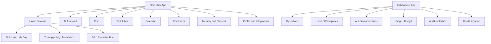
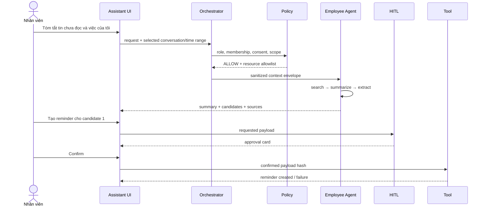
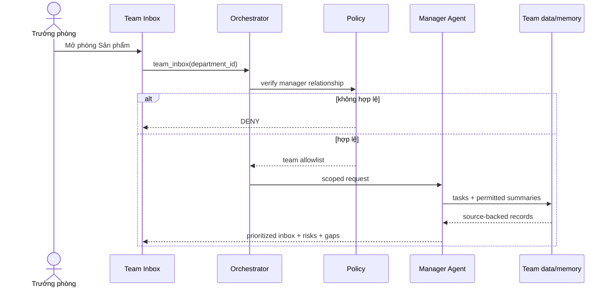
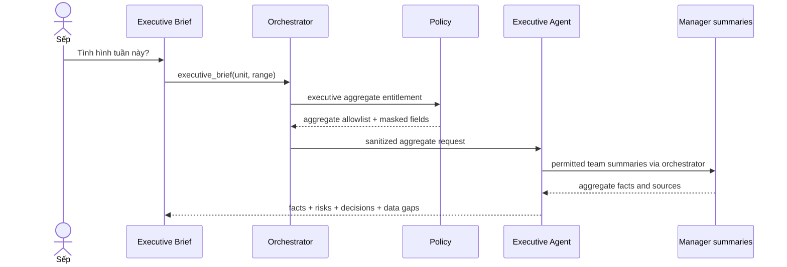
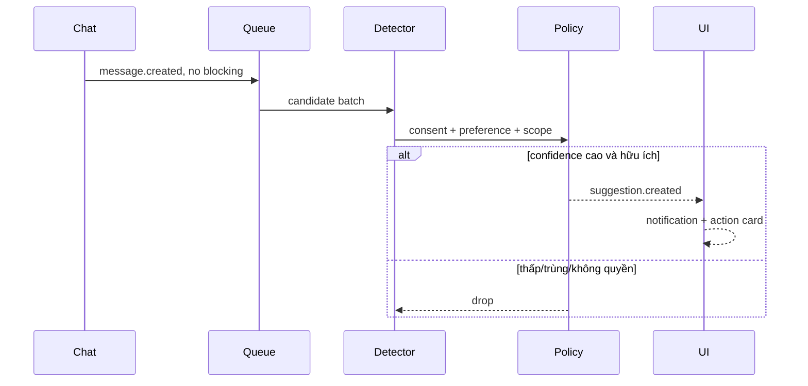

# UI/UX và workflow — Orbit CHAT-01

> Một user application thích ứng theo Sếp/Trưởng phòng/Nhân viên; một admin application riêng cho
> vận hành. Không tạo ba frontend độc lập.

## 1. Nguyên tắc trải nghiệm

1. **Actionable first:** task, deadline, decision và approval nằm trước đoạn tóm tắt dài.
2. **Trust visible:** kết quả có source chip, scope, confidence/ambiguity và trạng thái AI đang làm.
3. **HITL là UI riêng:** side effect hiển thị approval card, không giấu câu xác nhận trong chat text.
4. **Role-adaptive:** cùng component nhưng home/inbox khác theo quyền; không tin role từ client.
5. **Mobile first:** luồng summarize → review → confirm chạy được ở chiều rộng 360px.
6. **Safe failure:** lỗi calendar/model/permission có trạng thái và retry phù hợp, không báo thành công giả.

## 2. Information architecture



Platform Admin không có menu Chat/Memory nội dung. User có nhiều business entitlement vẫn vào một
app; server trả feature flags và scopes, UI chỉ render khả năng đã cấp.

## 3. Shell và điều hướng

### Desktop

```text
┌────────────────────────────────────────────────────────────────────┐
│ Orbit   Workspace ▾   Scope: Cá nhân/Phòng/Tổng hợp ▾   🔔   User │
├──────────────┬─────────────────────────────────────────────────────┤
│ Home         │                                                     │
│ Assistant    │               Nội dung màn hình                     │
│ Chat         │                                                     │
│ Inbox        │                                                     │
│ Calendar     │                                                     │
│ Reminders    │                                                     │
│ Memory       │                                                     │
│ Profile      │                                                     │
└──────────────┴─────────────────────────────────────────────────────┘
```

Scope picker chỉ hiển thị scope server cho phép. Đổi scope tạo request context mới và invalidate
state nhạy cảm trên client.

### Mobile

- Bottom nav: Home, Assistant, Inbox, Calendar, More.
- Source mở bottom sheet; approval card sticky phía dưới cho đến confirm/reject.
- Team/aggregate scope có badge màu và tên đơn vị để tránh thao tác nhầm.

## 4. Home theo vai trò

### 4.1 Nhân viên — My Day

```text
┌────────────────────────────────────┐
│ Chào Lan · Thứ Năm, 13/08           │
│ [Tóm tắt tin chưa đọc] [Hỏi Orbit]  │
├────────────────────────────────────┤
│ Hôm nay: 3 việc · 2 lịch · 1 gợi ý  │
├────────────────────────────────────┤
│ 09:00  Họp dự án                    │
│ ⚠ 14:00 Nộp báo cáo   [source]      │
│ ✨ Gợi ý: gọi khách lúc 16:00        │
│    [Bỏ qua] [Sửa] [Tạo reminder]    │
└────────────────────────────────────┘
```

Thành phần: unread summary card, today timeline, personal task inbox, proactive suggestions và
calendar connection state.

### 4.2 Trưởng phòng — Team Inbox

```text
┌──────────────────────────────────────────────────────────┐
│ Phòng Sản phẩm · 4 trễ · 6 sắp hạn · 2 chưa có owner     │
│ [Overdue] [Due soon] [Blocked] [Unassigned]               │
├──────────────────────────────────────────────────────────┤
│ Ưu tiên │ Việc              │ Owner │ Hạn     │ Nguồn     │
│ Cao     │ Chốt API contract │ Minh  │ Hôm nay │ 3 sources │
│ Cao     │ Deploy staging    │ —     │ 14/08   │ 1 source  │
├──────────────────────────────────────────────────────────┤
│ AI brief: 2 rủi ro, 1 quyết định cần chốt   [Mở brief]    │
└──────────────────────────────────────────────────────────┘
```

Không hiển thị sentiment cá nhân hoặc “điểm năng suất”. Workload chỉ ghi rõ dựa trên task records.

### 4.3 Sếp — Executive Brief

```text
┌──────────────────────────────────────────────────────────┐
│ Toàn đơn vị · cập nhật 08:30 · Aggregate scope           │
├───────────┬───────────┬────────────┬─────────────────────┤
│ 12 due    │ 4 overdue │ 3 risks    │ 2 decisions needed  │
├───────────┴───────────┴────────────┴─────────────────────┤
│ Quyết định cần chốt                                     │
│ 1. Ưu tiên nguồn lực cho release A · hạn 15/08 [sources] │
│ Rủi ro cao                                               │
│ • Phụ thuộc API phòng B đang chậm 2 ngày [sources]       │
│ Data gaps: Phòng C chưa cập nhật task từ hôm qua         │
└──────────────────────────────────────────────────────────┘
```

Facts, inference/recommendation và data gaps được trình bày tách biệt.

## 5. Assistant workspace

```text
┌───────────────────────────────────────────────────────────────┐
│ Assistant · Scope: Cá nhân ▾ · Agent: Employee               │
├───────────────────────────────────────────────────────────────┤
│ Bạn: Tóm tắt tin chưa đọc và việc của tôi                    │
│                                                               │
│ Orbit: 2 quyết định · 3 task candidates · 1 câu hỏi mở        │
│ [Decision source chips...]                                    │
│ ┌ Task candidate ───────────────────────────────────────────┐ │
│ │ Gửi báo cáo cho An · 16:00 14/08 · confidence 94%        │ │
│ │ Nguồn: #dự-án · msg 1842                                 │ │
│ │ [Bỏ qua] [Sửa] [Tạo task] [Tạo reminder]                 │ │
│ └───────────────────────────────────────────────────────────┘ │
├───────────────────────────────────────────────────────────────┤
│ Hỏi Orbit...                                      [Gửi]       │
└───────────────────────────────────────────────────────────────┘
```

Phải có:

- Scope/agent badge lấy từ response, không tự suy theo URL.
- Streaming status: “Đang kiểm quyền”, “Đang tìm 3 nguồn”, “Đang chờ xác nhận”.
- Source drawer: conversation/thread, timestamp, excerpt đã mask; click chỉ mở nếu còn quyền.
- Task/action card: confidence chỉ hiện khi hữu ích; ambiguity hiện bằng ngôn ngữ tự nhiên.
- Không hiển thị chain-of-thought; chỉ status, sources và rationale ngắn.

## 6. Approval card

```text
┌ Xác nhận tạo sự kiện ───────────────────────────┐
│ Tiêu đề     Họp dự án                           │
│ Thời gian   15:00–15:30, 14/08/2026 (GMT+7)     │
│ Người tham gia  Minh, An                         │
│ Calendar    lan@company.x                        │
│ Nguồn       #du-an · 2 messages                  │
│                                                │
│ [Hủy]                    [Sửa] [Xác nhận tạo]   │
└────────────────────────────────────────────────┘
```

Các trường bắt buộc: action, target account/resource, participants, time/timezone, source, data sẽ
được gửi ra ngoài. Nếu user sửa, card trở về `review_required`; token xác nhận cũ không dùng lại.

Trạng thái: `draft → review_required → pending_confirmation → executing → succeeded|failed|expired`.

## 7. Workflow chi tiết

### 7.1 Nhân viên tóm tắt và tạo reminder



### 7.2 Trưởng phòng xem Team Inbox



### 7.3 Sếp hỏi tình hình



### 7.4 Proactive suggestion



### 7.5 Deny/mask

Khi user yêu cầu ngoài quyền, UI không trả màn hình lỗi kỹ thuật. Card cần có: điều gì không thể làm,
scope hiện tại, lý do policy ở mức user hiểu được và action an toàn như đổi scope/xin consent. Không
liệt kê tài nguyên tồn tại mà user không được biết.

## 8. Màn hình chức năng

| Màn hình | Vai trò | Nội dung chính | P0/P1 |
|---|---|---|---|
| Login/workspace | Tất cả | Auth, chọn workspace | P0 |
| My Day | Nhân viên | Task, calendar, proactive suggestion | P0 |
| Team Inbox | Trưởng phòng | Overdue/due soon/blocked/unassigned | P0 |
| Executive Brief | Sếp | Facts, risks, decisions, data gaps | P0 |
| Assistant | Tất cả | Role-aware chat, source, tool/HITL cards | P0 |
| Chat | Tất cả | Conversation + per-chat AI consent | P0 |
| Tasks/Inbox | User | Accept/edit/dismiss, filters | P0 |
| Calendar | User | Personal events, connect status | P0 |
| Memory & Consent | User | View/edit/delete/revoke | P0 |
| Admin usage | Platform admin | Token/cost/quota alerts | P0 |
| Admin audit | Platform admin | Metadata trace, no raw content | P0 |
| Approval inbox | Manager/authorized approver | Cross-person/cross-team requests | P1 |
| Two-way calendar conflict UI | User | Sync status/conflict | P1 |

## 9. UI states bắt buộc

- Empty: giải thích cách cấp consent/kết nối calendar, có CTA.
- Loading/streaming: skeleton + bước đang chạy, có Cancel.
- Partial: kết quả phần nào thành công, tool nào lỗi, retry đúng phần.
- Permission denied: rationale an toàn, không tiết lộ resource.
- Needs clarification: một câu hỏi, input phù hợp như date/time/people picker.
- Awaiting approval: card cố định, hết hạn rõ.
- Success: link tới task/event và undo nếu backend hỗ trợ.
- Offline/reconnect: giữ draft; fetch lại notification bền.
- Budget exceeded: fallback/cooldown và hướng dẫn admin, không loop retry.

## 10. Design tokens và accessibility tối thiểu

- Xanh dương: Executive; tím: Manager; xanh lá: Employee; cam: HITL; đỏ: DENY; xám: masked/data gap.
- Màu không phải tín hiệu duy nhất; luôn có icon + label.
- Focus visible, keyboard cho approval, label form, contrast WCAG AA, vùng bấm ≥44px.
- Timestamp luôn kèm timezone ở approval và calendar.
- Không đặt raw PII trong URL, analytics event hoặc toast.

## 11. Event analytics không chứa nội dung

Cho phép: `screen_view`, `agent_run_started`, `route_selected`, `suggestion_shown`, `suggestion_accepted`,
`suggestion_edited`, `suggestion_dismissed`, `approval_confirmed`, `tool_succeeded`, `tool_failed`,
latency/token/cache hit và reason code.

Không gửi: prompt text, raw message, task title, calendar title, participant email hoặc source excerpt.

## 12. Acceptance checklist UI

- Ba role thấy đúng home và không thấy navigation ngoài entitlement.
- Scope badge và source luôn hiện cho team/aggregate result.
- Side effect không thể execute nếu bỏ qua approval card.
- Mobile 360px hoàn tất được employee flow và confirm calendar.
- Deny, clarify, partial error, expired approval và reconnect đều có trạng thái test được.
- User/Admin lint + build pass; automated component/e2e cover ba happy path và ba denial path.
