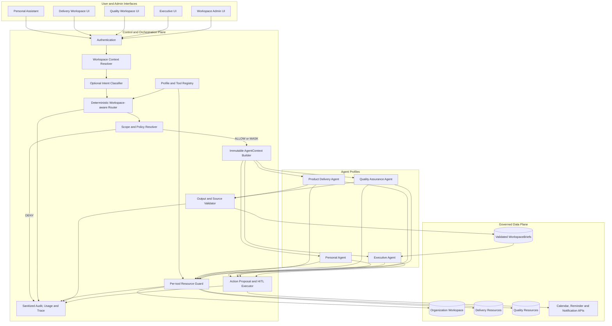
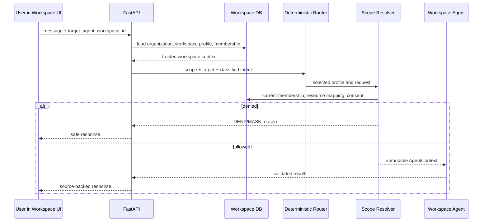
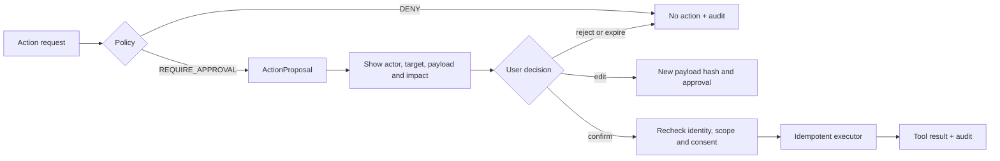
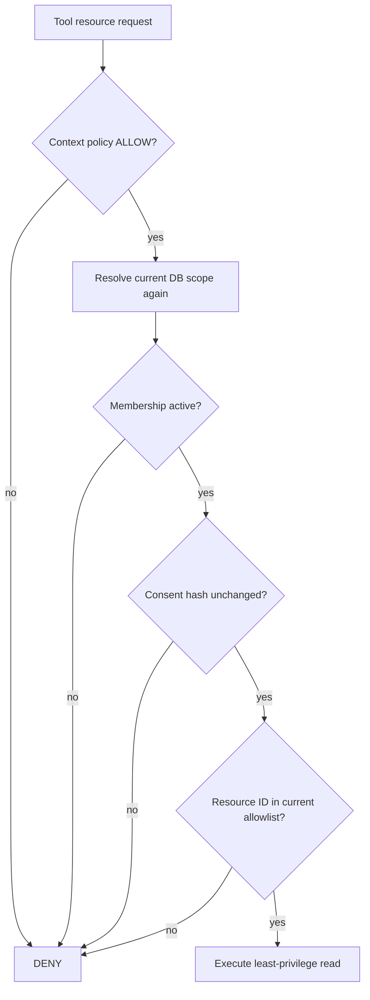
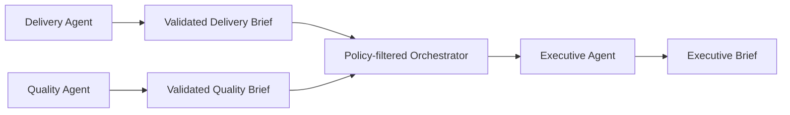
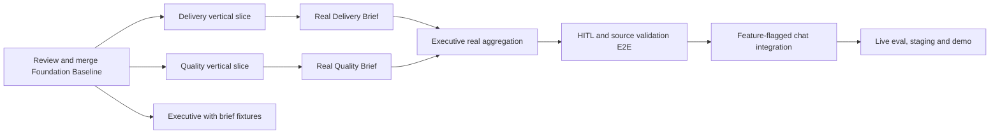

# Kiến trúc hệ thống Multi-Agent theo Workspace — Orbit CHAT-01

> Tài liệu kiến trúc canonical cho mô hình Product Delivery + Quality Assurance + Executive
>
> Cập nhật: 2026-08-18
>
> Nguyên tắc: workspace xác định agent mặc định; code quyết định quyền và routing; LLM xử lý nghiệp vụ trong scope đã được cấp.

## 1. Quyết định kiến trúc

Một công ty được biểu diễn bằng một `Organization Workspace`. Bên trong công ty có hai `Agent Workspace` nghiệp vụ và một Executive aggregate scope:

```text
Organization Workspace: Orbit Demo Company
├── Agent Workspace: Product Delivery
│   └── Product Delivery Agent profile
├── Agent Workspace: Quality Assurance
│   └── Quality Assurance Agent profile
└── Executive aggregate scope
    └── Executive Agent profile
```

Ba agent không phải ba service hoặc ba bản sao LangGraph độc lập. Chúng là ba profile chạy trên một orchestration core chung:

```text
Agent profile
= domain prompt/version
+ allowed intents
+ allowed scope
+ tool allowlist
+ reasoning/output rules
+ policy rules
+ runtime budget
+ evaluation suite
```

Mỗi request tạo một `AgentContext` riêng theo actor. Không tạo một Workspace Agent instance vĩnh viễn cho mỗi user.

```text
Quality Agent profile
├── User A + AgentContext A
├── User B + AgentContext B
└── Quality Lead + AgentContext Lead
```

Cùng một agent profile nhưng dữ liệu và capability hiệu lực khác nhau theo membership, role, resource mapping và consent của actor.

## 2. Sơ đồ kiến trúc tổng thể



## 3. Router được áp dụng ở đâu

### 3.1 Khi user đã ở trong Agent Workspace

Workspace context là nguồn route chính. LLM không cần đoán agent.

Ví dụ request từ Quality Workspace:

```json
{
  "message": "Release đã đủ điều kiện chưa?",
  "requested_scope": "workspace",
  "target_agent_workspace_id": "qa-workspace-01"
}
```

Server đọc profile đáng tin cậy từ database:

```text
qa-workspace-01
→ organization = orbit-demo
→ agent_profile = quality_assurance
→ router dispatch Quality Agent runtime
```

Client không được gửi `agent_profile`, business role hoặc tool allowlist.



Trong luồng này router là một **Workspace-aware Agent Dispatcher**. Nó có trách nhiệm:

- Nạp đúng profile và prompt version.
- Chỉ cấp đúng tool allowlist.
- Kiểm tra requested scope và intent có hợp profile không.
- Kiểm tra master/profile feature flag.
- Chặn workspace khác organization hoặc profile mismatch.
- Ghi route decision vào trace/audit.

### 3.2 Khi chưa có workspace rõ ràng

LLM hoặc rule-based classifier chỉ được dùng để đề xuất intent tại các điểm vào chung:

- Personal Assistant hỏi về một phòng ban nhưng chưa chọn workspace.
- Organization-level search box.
- Yêu cầu có thể là Delivery, Quality hoặc Executive aggregate.

```text
Natural-language request
→ classifier trả strict intent enum + confidence
→ code kiểm tra target workspace và entitlement
→ deterministic router quyết định cuối
```

Classifier không được quyết định quyền. Nếu confidence thấp hoặc có nhiều workspace phù hợp, hệ thống hỏi lại user hoặc yêu cầu user chọn workspace.

### 3.3 Các route mặc định

| Điểm vào | Route mặc định |
|---|---|
| Personal Workspace | Personal Agent |
| Product Delivery Workspace | Product Delivery Agent |
| Quality Assurance Workspace | Quality Assurance Agent |
| Executive UI với aggregate entitlement | Executive Agent |
| Chat chung chưa có target | Classify intent → code validate → route hoặc clarify |

Nếu user đang ở Quality Workspace nhưng hỏi raw Delivery data, router không tự chuyển quyền. Hệ thống chỉ có thể đề nghị đổi workspace nếu user có Delivery entitlement, đề nghị dùng Executive aggregate nếu phù hợp, hoặc từ chối.

## 4. Workspace Agent tạo ra giá trị gì

Workspace Agent không chỉ là một nhóm tool. Nó là lớp intelligence và governance chung của phòng ban:

```text
Workspace Agent
= domain semantics
+ retrieval strategy
+ scoped tools
+ business reasoning rules
+ fact/inference separation
+ source grounding
+ freshness and data-gap handling
+ standardized WorkspaceBrief
+ controlled action proposals
+ evaluation criteria
```

### 4.1 Product Delivery Agent

Chuyển task, milestone, conversation và dependency rời rạc thành:

- Tiến độ milestone/release.
- Blocker, overdue và due-soon items.
- Owner/deadline còn thiếu hoặc mơ hồ.
- Cross-workspace dependency.
- Decision cần manager hoặc Executive.
- Delivery Brief có source và freshness.

### 4.2 Quality Assurance Agent

Chuyển bug, test case và release check thành:

- Test progress và failed/blocked tests.
- Critical defects và quality risks.
- Release readiness: `READY | AT_RISK | NOT_READY`.
- Điều kiện còn thiếu để release.
- Dependency tới Delivery release.
- Quality Brief có source và freshness.

### 4.3 Executive Agent

Không đọc toàn bộ raw data. Executive Agent tổng hợp:

- Validated Delivery Brief.
- Validated Quality Brief.
- Cross-workspace risks/dependencies.
- Decisions needed và recommendations.
- Stale/missing brief dưới dạng data gaps.

Executive entitlement không phải super-admin entitlement.

## 5. Trách nhiệm của Workspace Agent ngoài tool

| Trách nhiệm | Mô tả |
|---|---|
| Domain interpretation | Hiểu trạng thái, luật và thuật ngữ của phòng ban |
| Retrieval planning | Chọn dữ liệu tối thiểu cần cho intent; không tải toàn bộ workspace |
| Business reasoning | Tách fact, inference, risk, recommendation và decision needed |
| Source grounding | Mỗi fact quan trọng trỏ về source IDs được policy cho phép |
| Freshness | Đánh dấu stale, partial và data gaps thay vì bịa dữ liệu |
| Output contract | Trả `ToolResult`, `WorkspaceBrief` hoặc `ActionProposal` đúng version |
| Handoff | Giao tiếp với agent khác bằng brief/reference có cấu trúc |
| HITL proposal | Chỉ đề xuất side effect; không tự thực thi trước confirmation |
| Observability | Giữ trace/profile/intent/policy/tool/source/latency metadata an toàn |
| Evaluation | Có golden cases và release gates riêng cho profile |

Workspace Agent không chịu trách nhiệm xác thực JWT, tự nâng quyền, tự truy vấn database ngoài scoped service hoặc tự phê duyệt side effect. Các trách nhiệm này thuộc shared core bằng code.

## 6. User, Personal Agent và Workspace Agent

User có active Agent Workspace membership được gọi Workspace Agent trong quyền của chính user đó.

```text
User identity
∩ Organization membership
∩ Agent Workspace membership
∩ business role
∩ requested resource scope
∩ resource mapping
∩ consent
∩ purpose/classification
= quyền hiệu lực của request
```

Hai user cùng gọi một Workspace Agent có thể nhận kết quả khác nhau vì `AgentContext` khác nhau.

### 6.1 Personal Agent không gọi trực tiếp Workspace Agent

Không dùng agent-to-agent call tự do:

```text
Personal Agent ──X──> Workspace Agent raw invocation
```

Nếu sau MVP cần truy cập workspace từ Personal Assistant, luồng phải đi qua Orchestrator:

```text
Personal request
→ structured invocation request
→ workspace selection
→ policy and scope resolver
→ new AgentContext bound to the same actor
→ Workspace Agent
→ filtered ToolResult/WorkspaceBrief
→ Personal Agent presents the result
```

Personal Agent không truyền quyền, prompt, raw state hoặc cache của mình sang Workspace Agent.

### 6.2 Ma trận giao tiếp

| Caller | Có gọi trực tiếp không? | Cơ chế đúng |
|---|:---:|---|
| User trong Agent Workspace | Có, qua dispatcher/policy | Workspace context → AgentContext → profile |
| Personal Agent | Không | Orchestrator-mediated request sau MVP |
| Delivery Agent → Quality Agent | Không | Structured dependency hoặc WorkspaceBrief |
| Quality Agent → Delivery Agent | Không | Structured dependency hoặc WorkspaceBrief |
| Executive Agent | Không đọc raw agent state | Chỉ đọc validated WorkspaceBrief được cấp quyền |
| Workspace admin | Không nếu thiếu business entitlement | Chỉ cấu hình workspace/membership/resource mapping |
| Platform admin | Không mặc định | System operation hoặc time-bound support grant |

## 7. Policy, response và HITL

Policy có bốn kết quả chuẩn:

| Decision | Khi dùng | Kết quả |
|---|---|---|
| `ALLOW` | Đúng identity, scope, membership, resource và consent | Chạy read tool/agent và trả kết quả |
| `MASK` | Có thể trả aggregate sau khi loại field nhạy cảm | Trả payload đã giảm scope/redact |
| `DENY` | Sai workspace, thiếu entitlement, revoke hoặc guessed resource | Không gọi retrieval/model/tool bị cấm |
| `REQUIRE_APPROVAL` | Có side effect hoặc action policy yêu cầu duyệt | Tạo proposal, chưa thực thi |

### 7.1 Read-only không cần HITL mặc định

Các thao tác sau chỉ cần policy `ALLOW` và output/source validation:

- Tóm tắt tiến độ.
- Liệt kê blocker hoặc critical defect.
- Kiểm tra release readiness.
- Đọc WorkspaceBrief được cấp quyền.
- Phân tích dependency.

### 7.2 Side effect bắt buộc HITL

- Tạo/sửa/xóa task.
- Assign owner hoặc đổi deadline.
- Đổi bug severity/status.
- Gửi reminder/notification.
- Tạo, sửa hoặc hủy meeting.
- Chia sẻ brief sang workspace khác nếu policy yêu cầu.



HITL không phải bước bắt buộc để “trả mọi câu trả lời”; nó bảo vệ các hành động làm thay đổi trạng thái hoặc ảnh hưởng người khác.

## 8. Data boundary và resource guard

MVP dùng một PostgreSQL chung, phân vùng logic bằng:

```text
organization_workspace_id
+ agent_workspace_id
+ actor membership
+ resource mapping
+ consent scope hash
+ purpose/classification
```

Không cần database vật lý riêng cho mỗi phòng ban ở MVP. Mọi query/retrieval phải bind tenant và Agent Workspace ngay trong truy vấn, không lấy toàn bộ rồi lọc sau.



Resource guard được kiểm tra tại mỗi specialist tool boundary để membership/consent revoke có hiệu lực ở lần gọi kế tiếp.

## 9. Agent handoff và WorkspaceBrief

Agent không chat tự do với nhau và không truyền system prompt, token hoặc toàn bộ graph state.



`WorkspaceBrief` bắt buộc có:

- Schema version.
- Organization và Agent Workspace IDs.
- Producer profile.
- Period, generated time và expiry.
- Facts/risks/dependencies/decisions/data gaps.
- Source references thuộc đúng producing workspace.

Brief stale hoặc thiếu không cho Executive tự động đọc raw chat để bù; Executive phải báo data gap.

## 10. Foundation đã hoàn thành

Tên giai đoạn trong kế hoạch: **Giai đoạn 0 — Foundation/Contract Baseline**.

| Foundation | Trạng thái working tree | Ý nghĩa |
|---|---|---|
| PR-00 Quality rename | Hoàn thành | `quality_assurance` thống nhất code/migration/test |
| Shared contract v1.0 | Hoàn thành | Context, source, tool result, proposal và briefs dùng chung |
| Feature flags | Hoàn thành baseline | Master + từng profile mặc định tắt |
| Agent Workspace models/migration | Hoàn thành baseline | Có workspace, membership và conversation mapping |
| Agent Workspace management API | Hoàn thành baseline | Owner/admin cấu hình, business entitlement tách riêng |
| Scope Resolver | Hoàn thành baseline | Organization/profile/role/scope deny-by-default |
| Consent-aware resource mapping | Hoàn thành baseline | Chỉ mapped group conversation có active AI consent vào scope |
| Resource Guard | Hoàn thành baseline | Recheck membership/consent/resource tại tool boundary |
| Profile/tool registry | Hoàn thành skeleton | Tool allowlist riêng cho Personal/Delivery/Quality/Executive |
| Deterministic router | Hoàn thành skeleton | Workspace-aware dispatch, không tin client profile |
| Golden dataset | Hoàn thành v1 | 150 case cho routing/policy/brief/HITL/stale/revoke |

Kết quả kiểm thử gần nhất:

- Full backend: `281/281` pass.
- Security regression: `62/62` pass.
- Golden dataset: `150/150` case hợp lệ.
- Ruff toàn bộ `src/tests/scripts`: pass.
- Migration upgrade và downgrade trên database tạm: pass.
- User/Admin frontend production builds: pass.

Các thay đổi foundation hiện ở working tree cục bộ, chưa commit/merge lên remote.

## 11. Đánh giá độ chặt chẽ và readiness

### 11.1 Đã đủ để bắt đầu triển khai ba agent chưa?

**Có.** Foundation hiện đủ chặt để ba workstream bắt đầu song song:

- Delivery xây domain schema, scoped read tools và Delivery Brief producer.
- Quality xây quality metadata/readiness rules, scoped read tools và Quality Brief producer.
- Executive xây aggregate reasoning trên Delivery/Quality Brief fixtures.

Các workstream đã có contract, workspace boundary, membership model, router registry, policy decision và dataset chung nên không cần tự thiết kế lại shared interface.

### 11.2 Đã đủ để demo/production chưa?

**Chưa.** Những phần sau vẫn là gate bắt buộc:

| Phần còn thiếu | Vì sao cần |
|---|---|
| Delivery/Quality scoped tools thật | Registry hiện mới là allowlist; chưa có domain implementation |
| Delivery/Quality brief producers | Executive chưa có brief thật để tiêu thụ |
| WorkspaceBrief persistence/service | Cần version, expiry, revoke invalidation và query aggregate |
| Executive aggregate implementation | Hiện mới có contract và route skeleton |
| Intent classifier/global entry | Chỉ cần cho điểm vào không có workspace rõ ràng |
| Router integration vào `/chat` | Chưa bật vì specialist runtime chưa hoàn chỉnh |
| HITL executor/store/idempotency | Hiện mới có ActionProposal contract và existing personal confirmation flow |
| Output/source validation pipeline | Contract có validator nhưng chưa nối mọi agent run/tool result |
| Agent run audit/metrics | Cần production observability và incident evidence |
| Agent Workspace UI/seed/demo | Cần cấu hình và trình diễn mà không thao tác DB trực tiếp |
| Live-agent evaluation | Dataset v1 hiện là structural contract/policy baseline |

### 11.3 Kết luận nghiệp vụ doanh nghiệp

Thiết kế hiện tại đúng logic doanh nghiệp ở các điểm cốt lõi:

- Workspace là biên nghiệp vụ; user sử dụng agent chung nhưng giữ quyền riêng theo actor.
- Admin có control-plane capability, không tự động có quyền đọc business data.
- Member/lead/executive_viewer là entitlement tách biệt.
- Executive dùng aggregate brief, không phải superuser raw data.
- Policy và quyền được enforce bằng code, không giao cho LLM.
- Read-only được phép trả nhanh; side effect đi qua HITL.
- Agent giao tiếp bằng structured brief/reference, không chia sẻ state tự do.
- Revoke membership/consent có hiệu lực tại lần kiểm tra tiếp theo.

Vì vậy foundation được đánh giá là **đúng hướng, đủ chặt để bắt đầu ba vertical slice**, nhưng chỉ được gọi là production-ready sau khi các gate ở mục 11.2 hoàn thành và vượt qua live-agent/security E2E.

## 12. Thứ tự triển khai tiếp theo



Chi tiết phân công, dependency và release gates nằm tại `docs/MULTI_AGENT_IMPLEMENTATION_PLAN.md`. Tiến độ triển khai và giá trị bàn giao nằm tại `docs/MULTI_AGENT_PROGRESS.md`.
